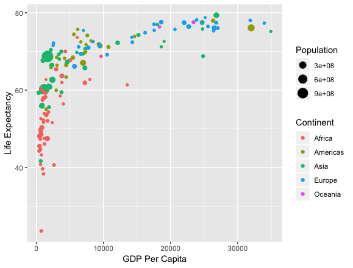

In this section, we'll discuss the Grammar of Graphics developed by [Leland Wilkinson](http://www.powells.com/book/the-grammar-of-graphics-9780387245447) and implemented in R via [Hadley Wickham](http://www.powells.com/book/ggplot2-elegant-graphics-for-data-analysis-9783319242750/68-428).  We'll see how this is applied to a scatterplot with and without a regression line.  These ideas will then be extended in Part 2 of the workshop.

## The Grammar of Graphics



- What are the variables here?
- What is the observational unit?
    - i.e., what is the THING being measured?
- How are the variables mapped to aesthetics?

---

## What is a statistical graphic?


### A `mapping` of `data` variables

### to `aes()`thetic attributes

### of `geom_`etric objects.

---

**Back to basics**

Consider the following data in tidy format:

```{r include=FALSE}
library(dplyr)

simple_ex <- data_frame(
    A = c(1980, 1990, 2000, 2010),
    B = c(1, 2, 4, 5),
    C = c(3, 2, 1, 2),
    D = c("cold", "cold", "hot", "hot")
  )
simple_ex
```

- Sketch the graphics below on paper, where the `x`-axis is variable `A` and the `y`-axis is variable `B`

1. A scatterplot
2. A scatter plot where the `color` of the points corresponds to `D` and the `size` of the points corresponds to `C`

---

1. A scatterplot

```{r}
library(ggplot2)
ggplot(data = simple_ex, mapping = aes(x = A, y = B)) + 
  geom_point()
```

2. A scatter plot where the `color` of the points corresponds to `D` and the `size` of the points corresponds to `C`

```{r}
ggplot(data = simple_ex, mapping = aes(x = A, y = B, color = D, size = C)) + 
  geom_point()
```

Note that R isn't "smart enough" to realize that "cold" should probably be set to blue and "hot" should be set to red. These are the default colors chosen based on alphabetic order of the words "cold" and "hot". These colors can be changed to something else as well using the `scale_color_manual()` function though.

---

## Your Task

Recreate the gapminder plot shown at the beginning of this workshop (and below) using `ggplot2` and the `gapminder` data frame in the `gapminder` package.  The [Data Visualization Cheat Sheet](https://github.com/rstudio/cheatsheets/raw/master/data-visualization-2.1.pdf) from [RStudio](https://www.rstudio.com/resources/cheatsheets/) may be helpful. In particular, check out `?labs` to better understand how to add labels to your plots.

**Note**:  To focus on only the rows in the data frame corresponding to 1992 we've created a dataset and saved the file as a CSV (basic spreadsheet) file in the `data` folder. Recall from this morning's [Data Wrangling workshop](https://cascadiarconf-wrangle.netlify.com), the `filter` function from `dplyr` can be used to perform this. (Try on your own to do this if you wish!)


```{r}
library(readr)
gap1992 <- read_csv("data/gap1992.csv")

#Space for your answer here.

## Could also be done with
library(gapminder)
gap1992 <- gapminder %>%
  filter(year == 1992)

## ONE SOLUTION
library(ggplot2)
ggplot(data = gap1992, 
       mapping = aes(x = gdpPercap, y = lifeExp, size = pop, color = continent)) +
  geom_point() +
  labs(x = "GDP Per Capita",
       y = "Life Expectancy",
       size = "Population",
       color = "Continent")
```

## What you learned in this section

- Identifying plot aesthetics
- Mapping data variables to aesthetics using the Grammar of Graphics 
- Applying a line of best fit to a scatterplot
- Using transformations on your data and labeling your axes